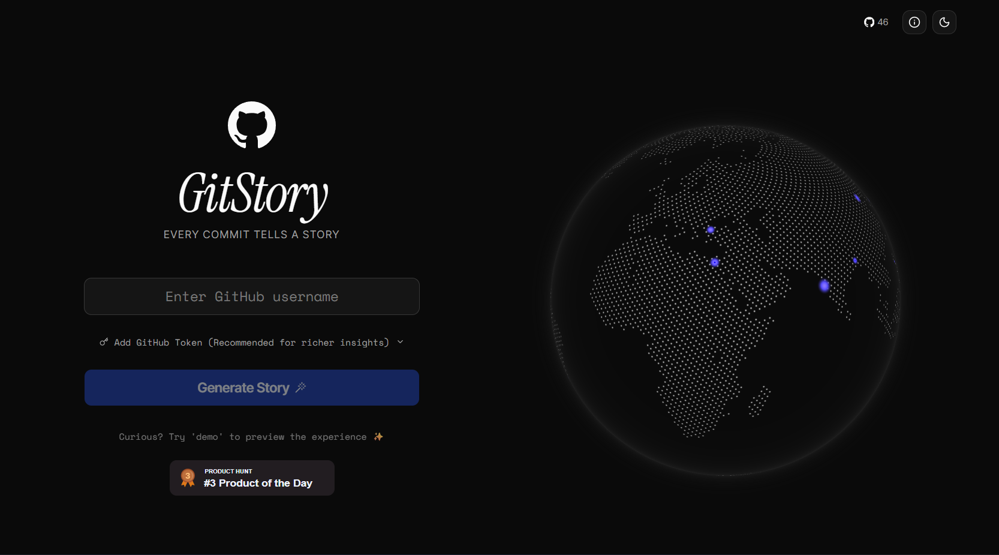

<p align="center">
  
</p>

<h1 align="center">GitStory</h1>

<p align="center">
  <strong>Your Code in Cinema — Every Commit Tells a Story</strong>
</p>

<p align="center">
  Transform your GitHub or GitLab journey into a cinematic masterpiece with stunning visuals, personalized insights, and sharable snapshots.
</p>

<p align="center">
  <a href="https://nextjs.org">
    
  </a>
  <a href="https://react.dev">
    
  </a>
  <a href="https://tailwindcss.com">
    
  </a>
  <a href="https://ui.shadcn.com">
    
  </a>
</p>

<p align="center">
  <a href="https://bun.sh">
    
  </a>
  
  <a href="https://gitstory.sitestash.org">
    
  </a>
</p>

---

## ✨ What is GitStory?

**GitStory** is a beautiful, Instagram Stories-style web app that transforms any GitHub or GitLab user's yearly activity into a cinematic, swipeable experience. Enter a username and watch your coding journey come alive through stunning animated slides showcasing:

- 📊 **Contribution Stats** — Total commits, longest streaks, busiest days
- 🔥 **Code Velocity** — Interactive charts showing commit frequency over time
- 💻 **Top Languages** — Beautifully visualized language breakdown with percentages
- 📁 **Top Repositories** — Highlight your most impactful projects
- ⏰ **Productivity Patterns** — Discover your peak coding hours and rhythm
- 🎭 **Developer Archetype** — Get assigned a fun coding persona based on your habits
- 👥 **Community Impact** — Followers, stars, and contribution breakdowns
- 📸 **Downloadable Snapshot** — Share your story as a stunning image

<p align="center">
  
</p>

---

## 🚀 Features

### 🎬 Story Experience

- **Swipeable Slides** — Navigate through your year like Instagram Stories
- **Auto-Progress** — Slides advance automatically with a progress bar
- **Pause on Hold** — Hold to pause and explore details
- **Smooth Animations** — Powered by Motion (Framer Motion)

### 📈 Data Insights

- **Multi-Platform Support** — Works with both GitHub and GitLab
- **OAuth Authentication** — Securely connect your account with one click
- **GitHub API Integration** — Fetches real data from GitHub's REST & GraphQL APIs
- **GitLab API Integration** — Full support for GitLab REST API
- **Private Repo Support** — Connect your account for richer insights
- **Smart Caching** — Efficient data fetching with React Query
- **Contribution Calendar** — Full year activity heatmap

### 🎨 Visual Design

- **Dark/Light Mode** — Fully themed with animated toggle
- **Premium UI Components** — 60+ shadcn/ui components
- **Interactive Globe** — 3D globe visualization on homepage
- **Confetti Celebrations** — Fun effects on story completion
- **Responsive Design** — Works beautifully on mobile and desktop

### 🔗 Sharing & SEO

- **Dynamic OG Images** — Auto-generated social preview images per user
- **PWA Ready** — Installable as a Progressive Web App
- **SEO Optimized** — Full metadata, structured data, and sitemap

---

## 🛠️ Tech Stack

| Category             | Technology                                                            |
| -------------------- | --------------------------------------------------------------------- |
| **Framework**        | [Next.js 16](https://nextjs.org) (App Router)                         |
| **Language**         | TypeScript                                                            |
| **Styling**          | [Tailwind CSS 4](https://tailwindcss.com)                             |
| **UI Library**       | [shadcn/ui](https://ui.shadcn.com) + [Radix UI](https://radix-ui.com) |
| **Animations**       | [Motion](https://motion.dev) (Framer Motion)                          |
| **Charts**           | [Recharts](https://recharts.org)                                      |
| **State**            | [React Query](https://tanstack.com/query) (TanStack Query)            |
| **Data Fetching**    | GitHub REST/GraphQL API + GitLab REST API                             |
| **Image Generation** | [@vercel/og](https://vercel.com/docs/functions/og-image-generation)   |
| **Package Manager**  | [Bun](https://bun.sh)                                                 |

---

## 📦 Project Structure

```
src/
├── app/
│   ├── (app)/              # Main app layout with header
│   │   ├── layout.tsx      # App shell with theme toggle & GitHub link
│   │   └── page.tsx        # Homepage with username input & globe
│   ├── [githubId]/         # Dynamic user story route
│   │   ├── page.tsx        # Story page (SSR data fetching)
│   │   ├── loading.tsx     # Loading skeleton
│   │   └── opengraph-image/# Dynamic OG image generation
│   ├── layout.tsx          # Root layout with fonts & metadata
│   ├── globals.css         # Tailwind + custom CSS variables
│   ├── manifest.ts         # PWA manifest
│   └── robots.ts           # SEO robots.txt
├── components/
│   ├── slides/             # Story slide components
│   │   ├── IntroSlide.tsx
│   │   ├── StatsSlide.tsx
│   │   ├── VelocitySlide.tsx
│   │   ├── ProductivitySlide.tsx
│   │   ├── LanguagesSlide.tsx
│   │   ├── ReposSlide.tsx
│   │   ├── CommunitySlide.tsx
│   │   ├── CompositionSlide.tsx
│   │   └── OutroSlide.tsx
│   ├── StoryView.tsx       # Main story container with navigation
│   ├── ui/                 # 60+ shadcn/ui components
│   └── custom/             # Custom components (icons, theme toggle)
├── services/
│   ├── githubService.ts    # GitHub API integration
│   ├── gitlabService.ts    # GitLab API integration
│   └── scoringAlgorithms.ts # Archetype & scoring logic
├── contexts/
│   └── auth-context.tsx    # Authentication state management
├── context/
├── hooks/
│   └── use-mobile.ts       # Mobile detection hook
├── lib/
│   ├── config.ts           # Site configuration
│   ├── constants.ts        # Demo/mock data
│   └── utils.ts            # Utility functions
└── types.ts                # TypeScript type definitions
```

---

## 🏃‍♂️ Getting Started

### Prerequisites

- [Bun](https://bun.sh) (recommended) or Node.js ≥20
- A GitHub account (optional: Personal Access Token for enhanced features)

### Installation

```bash
# Clone the repository
git clone https://github.com/vishkx/gitstory.git
cd gitstory

# Install dependencies
bun install

# Start development server
bun dev
```

Open [http://localhost:3000](http://localhost:3000) in your browser.

### Authentication (Recommended)

For richer insights including private repositories and higher API rate limits, connect your account:

#### GitHub OAuth

1. Click "GitHub" on the homepage
2. Authorize GitStory on GitHub
3. Your account is now connected!

#### GitLab OAuth

1. Click "GitLab" on the homepage
2. Authorize GitStory on GitLab
3. Your account is now connected!

> **Note**: Tokens are stored securely in HTTP-only cookies and never exposed to client-side JavaScript.

---

## 📜 Available Scripts

| Script      | Description                              |
| ----------- | ---------------------------------------- |
| `bun dev`   | Start development server with hot reload |
| `bun build` | Create optimized production build        |
| `bun start` | Start production server                  |
| `bun lint`  | Run ESLint for code quality              |

---

## 🎨 Customization

### Site Configuration

Update `src/lib/config.ts` to customize:

```ts
export const siteConfig = {
  title: "GitStory",
  description: "Your GitStory is here...",
  links: {
    github: "https://github.com/vishkx/gitstory",
  },
};
```

### Theme Colors

Modify CSS variables in `src/app/globals.css` to change the color scheme.

### Adding Slides

1. Create a new component in `src/components/slides/`
2. Add it to the `slides` array in `src/components/StoryView.tsx`

---

## 🌐 Deployment

GitStory is optimized for deployment on **Vercel**:

[](https://vercel.com/new/clone?repository-url=https://github.com/vishkx/gitstory)

Also works on:

- Netlify
- Docker
- Any Node.js hosting platform

For platform-specific instructions, see the [Next.js deployment docs](https://nextjs.org/docs/app/building-your-application/deploying).

---

## 🙏 Credits

Created and maintained by [vishkx](https://github.com/vishkx).

**Special thanks to:**

- [shadcn/ui](https://ui.shadcn.com) for the beautiful component library
- [Motion](https://motion.dev) for smooth animations
- [Recharts](https://recharts.org) for chart components
- [cobe](https://github.com/shuding/cobe) for the 3D globe

---

## 📄 License & Community

- **License**: This project is licensed under the **MIT License**. See [`LICENSE`](./LICENSE) for details.
- **Code of Conduct**: By participating in this project, you agree to follow the guidelines in [`CODE_OF_CONDUCT.md`](./CODE_OF_CONDUCT.md).

---

<p align="center">
  <strong>⭐ Star this repo if you found it useful!</strong>
</p>

<p align="center">
  <a href="https://gitstory.sitestash.org">Try GitStory Now →</a>
</p>
